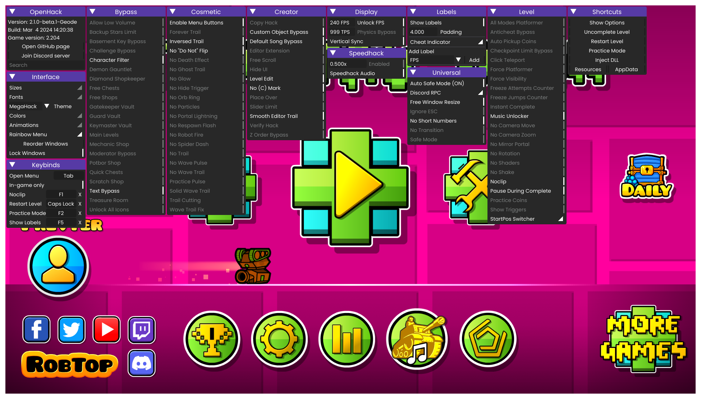

<div align="center">
    <a href="https://github.com/prevter/gdopenhack/releases/latest">
          
    </a>
    
    
    <a href="LICENSE">
      
    </a>
    <a href="https://github.com/prevter/gdopenhack/issues">
      
    </a>
    <a href="https://discord.gg/HaHn7RSJ4Q">
      
    </a>
    <a href="https://www.buymeacoffee.com/prevter">
      
    </a>
</div>
<br>
<div align="center">
   <a href="https://github.com/prevter/gdopenhack">
      
   </a>
   <h3 align="center">OpenHack</h3>
   <p align="center">
      A free and open source collection of hacks for Geometry Dash 2.2 with many features, including noclip, speedhack, startpos switcher, and more!
   </p>
</div>

<div align="center">
    Supports both <b>Geode</b> and <b>Vanilla</b> Geometry Dash!
</div>

## Table of Contents
- [About](#about)
- [Features](#features)
- [Installation](#installation)
    - [Geode](#geode)
    - [Vanilla](#vanilla)
- [Building](#building)
- [Contributing](#contributing)
- [License](#license)
- [Contact](#contact)
- [Support](#support)
- [Acknowledgements](#acknowledgements)

## About
Yet another Geometry Dash modded client! Has almost everything you'll need, with features being constantly added.



Please visit the [issues](https://github.com/prevter/gdopenhack/issues) page for known issues and planned features (and feel free to leave your own suggestions).

## Features
- Customizable GUI with a variety of settings and themes.
- Noclip, speedhack, and other popular hacks.
- StartPos Switcher
- Customizable keybinds
- Discord Rich Presence
- Automatic updates
- Backwards/Forwards compatibility with different versions of Geometry Dash (2.200, 2.201, 2.202, 2.203, 2.204+) (vanilla only)
- And more!

## Installation
> **Note:** OpenHack is only compatible with Windows and Linux (using Wine). Other operating systems are not supported for now.

There are two ways to install OpenHack: using Geode, or manually installing the mod. Each method has its own advantages and disadvantages, so choose the one that best suits your needs.

### Geode
1. Find "OpenHack" in the Geode mod list.
2. Click the "Install" button to install the mod.
3. Restart the game, and press "Tab" to open the mod menu.

You can also install the mod manually by downloading the latest `.geode` release from the [releases](https://github.com/prevter/gdopenhack/releases) page.

### Vanilla
1. Download the latest `.zip` release from the [releases](https://github.com/prevter/gdopenhack/releases) page.
2. Extract everything from the `.zip` file to your Geometry Dash folder. (Right click on Geometry Dash in your Steam library, and select "Manage" -> "Browse local files")
3. Run the game, and press "Tab" to open the mod menu.

### Extra steps for Linux
If you're using Linux, in addition to the above steps, you'll need to add startup parameters to the game's launch options. 
To do this, right-click on Geometry Dash in your Steam library, click "Properties", and then enter following parameters to the launch options:
```sh
WINEDLLOVERRIDES="xinput9_1_0=n,b" %command%
```
After that, you should be able to run the game and use the mod as usual.

## Building
### Prerequisites
- [CMake](https://cmake.org/download/)
- [Git](https://git-scm.com/downloads)
- [Visual Studio](https://visualstudio.microsoft.com/downloads/) (Install the "Desktop development with C++" workload)
- [Geode CLI](https://docs.geode-sdk.org/getting-started/geode-cli) (optional, for building the Geode mod)

### Instructions
Clone the repository:
```sh
git clone https://github.com/prevter/gdopenhack --recursive
cd gdopenhack
```

> Next steps can be done using the command line or using CMake build tools for VSCode.

Build using CLI:
```sh
cmake -B build -A Win32 -DCMAKE_BUILD_TYPE=RelWithDebInfo
cmake --build build --config RelWithDebInfo
```

Build using CMake Tools for VSCode:
1. Open the project in VSCode.
2. Press `Ctrl+Shift+P` and select "CMake: Select a Kit".
3. Choose the "Visual Studio Community 2022 Release - x86" or "Visual Studio Community 2022 Release - amd64_x86" kit.
4. Press `Ctrl+Shift+P` and select "CMake: Build".

This will build both the Geode and vanilla versions of the mod.

The built mod will be located in the `bin` folder.
(If you're building the Geode mod, the `.geode` file will be installed automatically to your game's mods folder.)

## Contributing
Contributions are what make the open source community such an amazing place to learn, inspire, and create. Any contributions you make are greatly appreciated.
Please read [CONTRIBUTING.md](CONTRIBUTING.md) for more information.

## License
Distributed under the MIT License. See [LICENSE](LICENSE) for more information.

## Contact
Join the [Discord server](https://discord.gg/HaHn7RSJ4Q) to get in touch with the developers and other users.

If you want to contact me directly, you can do so via
- Discord: `@prevter`
- Email: `support@prevter.me`

## Support
If you like the project, consider supporting it by [buying me a coffee](https://www.buymeacoffee.com/prevter) or by contributing to the project. Any support is greatly appreciated and helps me keep motivated to work on the project and add new features!

## Acknowledgements
[MegaHack](https://absolllute.com/store/view_mega_hack_pro) by Absolute for design inspiration and ideas.

[GDH](https://github.com/TobyAdd/GDH) by TobyAdd for code reference.

[Geode](https://geode-sdk.org/) for the modding framework.

Also thanks to these awesome libraries that make this project possible:
- [ImGui](https://github.com/ocornut/imgui)
- [MinHook](https://github.com/TsudaKageyu/minhook)
- [spdlog](https://github.com/gabime/spdlog)