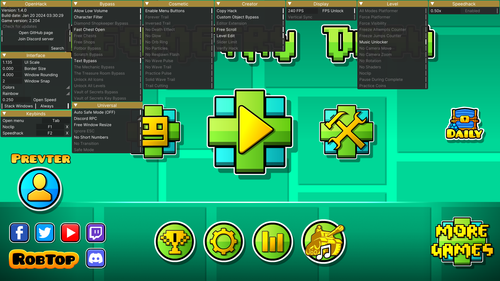

[](https://discord.gg/HaHn7RSJ4Q)

<div align="center">
    
    <h1 align="center">OpenHack</h1>
    <p align="center">
        A free and open source Geometry Dash modded client for version 2.2 with many features.
    </p>
</div>

<div align="center">
    <h3><b>Supports Geometry Dash version 2.200 - 2.204+</b></h3>
    Hacks were made in a way that makes them update-proof, so they should work even after the game updates.
</div>

## Table of Contents
- [About](#about)
- [Features](#features)
- [Installation](#installation)
- [Building](#building)
- [Contributing](#contributing)
- [License](#license)
- [Contact](#contact)
- [Acknowledgements](#acknowledgements)

## About
Yet another Geometry Dash modded client! I've been using [GDMegaOverlay](https://github.com/maxnut/GDMegaOverlay) for quite some time, but because it has been archived after the release of 2.2, I decided to make my own modded client. Project is still in early stages, so expect bugs and crashes, but I'm working on it! Be sure to check out the [issues](https://github.com/prevter/gdopenhack/issues) page for known issues and planned features (and feel free to leave your own suggestions).

Main goal of this project is primarily me getting more experience with C++ and game hacking, but I also needed a modded client for myself, sharing it with others in the process as well.

## Features
- [x] **Update-proof hacks!** (most of them should work even after the game updates)
- [x] Supports older versions of the game (2.200+)
- [x] Customizable menu with animations
- [x] Basic hacks (speedhack, noclip, etc.)
- [x] Hack search
- [x] Auto-updater
- [x] Discord Rich Presence
- [x] Keybinds

Planned:
- [ ] StartPos switcher
- [ ] Macro recorder
- [ ] More hacks

## Installation
1. Download the latest release from the [releases page](https://github.com/prevter/gdopenhack/releases).
2. Extract the zip file to game directory.
3. Run the game as usual.

If there are any issues, please check the [issues](https://github.com/prevter/gdopenhack/issues) page or create a new issue.

## Building
You will need to have Visual Studio 2022 installed with the C++ workload.  
You will also need to have the following installed:
- [CMake](https://cmake.org/download/)
- [Git](https://git-scm.com/downloads)

Once you have all of the above installed, you can clone the repository:
```sh
git clone https://github.com/prevter/gdopenhack --recursive
cd gdopenhack
```

Best way to build is to use Visual Studio Code with the "CMake Tools" extension:
1. Choose "Visual Studio Community 2022 Release - x86" as your kit and then press F7 to build.
2. Once the build is complete, you can find the executable inside the `bin` folder.

If you want to build using the command line, you can use the following commands:
```sh
cmake -B build -A Win32 -DCMAKE_BUILD_TYPE=Release
cmake --build build --config Release
```

After that, you also need to copy the following files to the game directory:
- `hacks/*` to `openhack/hacks/*`
- Get an Inter font from [here](https://fonts.google.com/specimen/Inter) and copy it to `openhack/Inter.ttf`

## Contributing
Contributions are welcome! Please read [CONTRIBUTING.md](CONTRIBUTING.md) for more information.

## License
Distributed under the MIT License. See [LICENSE](LICENSE) for more information.

## Contact
Join our Discord server: [discord.gg/HaHn7RSJ4Q](https://discord.gg/HaHn7RSJ4Q)  
Or you can just contact me directly: `prevter`

## Acknowledgements
[GDMegaOverlay](https://github.com/maxnut/GDMegaOverlay) by maxnut for most of the menu code to get me started.

[GDH](https://github.com/TobyAdd/GDH) by TobyAdd for JSON files

[MegaHack](https://absolllute.com/store/view_mega_hack_pro) by Absolute for design inspiration